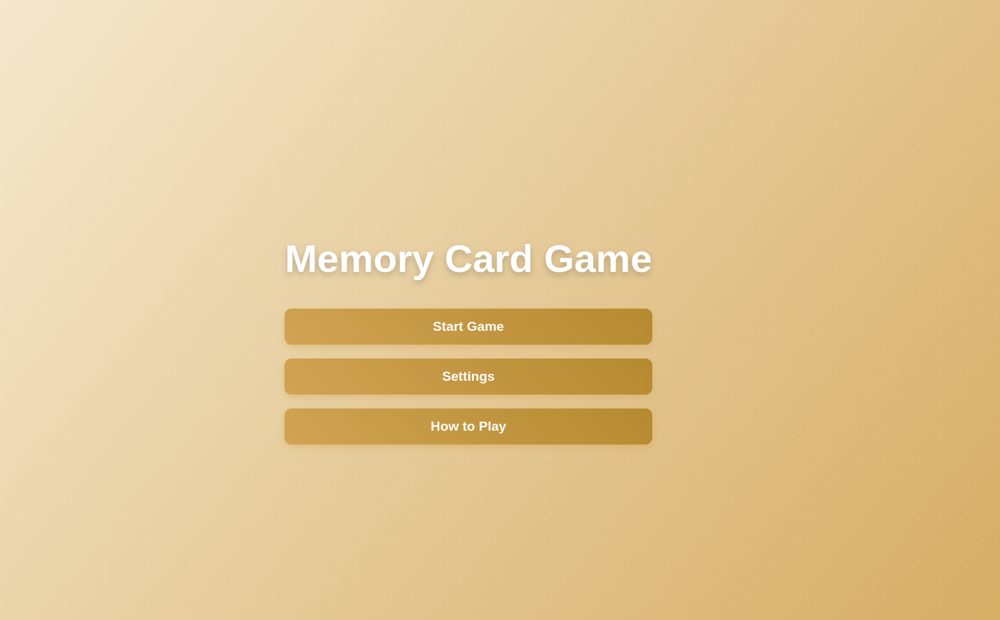

# Memory Card Game

## Overview
Memory Card Game is a fun and interactive web-based game designed to test and improve your memory skills. Match cards with similar images, earn points, and challenge yourself with different difficulty levels and themes!

## Features
- **Multiple Difficulty Levels**: Choose from Easy (4x4), Medium (6x6), or Hard (8x8) grids.
- **Themes**: Play with different themes like Fruits, Animals, or Shapes.
- **Special Cards**: Add excitement with Magic Cards (reveal or freeze time) or Spam Cards (shuffle or hide cards).
- **Game Modes**: Play in Classic, Timed Challenge, or Limited Moves modes.
- **Responsive Design**: Works on both desktop and mobile devices.

## How to Play
1. Open the game and select a difficulty level (Easy, Medium, or Hard).
2. Match pairs of cards by flipping them. A correct match earns points, while incorrect matches flip back.
3. Use special cards (if enabled) to gain bonuses or face challenges.
4. Track your score, moves, and time in real-time.
5. Save your high scores and compete with yourself!

## Play Online
Play the game at [Memory Card Game](https://eithar-wageh.github.io/Memory-Card-Game/mainPage).

## Screenshots

## Technologies Used
- **HTML5**: For the game structure.
- **CSS3**: For styling and animations.
- **JavaScript**: For game logic and interactivity.
- **Canvas Confetti**: For celebratory effects.

## Credits
Developed by Eithar Wageh. Feel free to contribute or provide feedback!

## License
This project is licensed under the MIT License.

